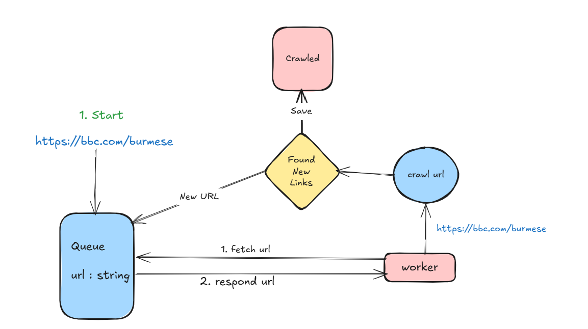
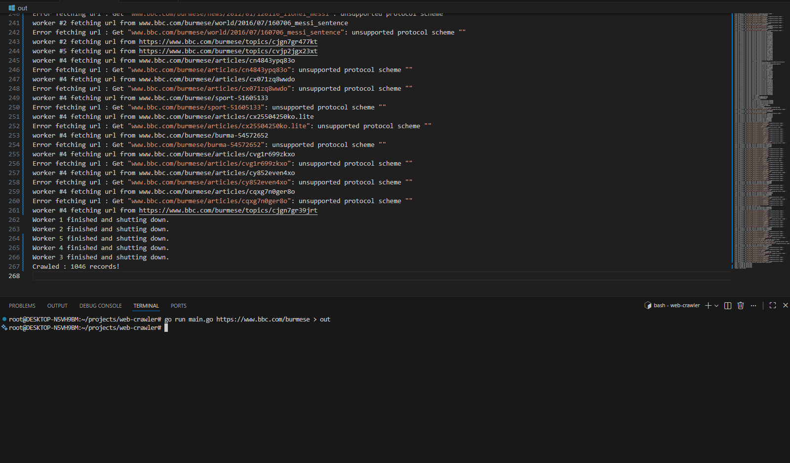

# 🕸️ Go Concurrent Web Crawler
Tiny web crawler for studying Data Structure and System Design. 

## 🚀 Features

- **Concurrent Worker Pool:** Efficiently scales crawling using multiple goroutines.
- **Thread-Safe State Management:** Custom `Queue` and `CrawlData` structures utilizing `sync.Mutex` to prevent race conditions during high-speed crawling.
- **Streaming HTML Tokenizer:** Uses `golang.org/x/net/html` to process HTML on the fly, maintaining a low memory footprint even with large pages.
- **Targeted Content Extraction:** Specifically tuned to capture `<title>` and `<p>` (paragraph) tags while ignoring noisy `<script>` and `<style>` blocks.
- **MongoDB Integration:** Built with the **MongoDB Go Driver v2**, featuring automatic timestamps and persistent storage.
- **URL Canonicalization:** Handles relative links (e.g., `/about`) by resolving them against the base URL.
- **Memory-Efficient Hashing:** Uses **FNV-64a** hashing to track visited URLs, minimizing the RAM required for the "visited" set.


## ⚙️ Configuration

Create a `.env` file in the project root to manage credentials and scaling:

```env
MONGO_HOST=mongodb+srv://<username>:<password>@cluster.mongodb.net/
WORKER_COUNT=5
SIZE=500
```

## 🚀 Getting Started

Follow these steps to get the crawler running on your local machine.

### 1. Prerequisites
- **Go:** Version 1.21 or higher installed.
- **MongoDB:** An active instance (local or MongoDB Atlas).
- **Git:** To clone the repository.

### 2. Installation
Clone the repository and install the required Go dependencies:

```bash
# Clone the repository
git clone [https://github.com/yourusername/go-crawler.git](https://github.com/yourusername/go-crawler.git)

# Navigate into the project directory
cd go-crawler

# Install Go modules (mongo-driver, godotenv, x/net/html)
go mod tidy ```


# System Design


# Results 
